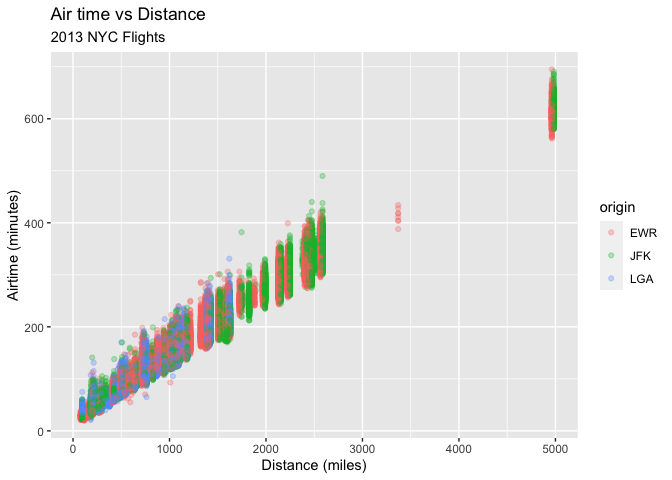

Flight Visualization
================
Eva
Fall 2021

## Check Out This Plot

This plot shows visually the expectation that **airtime has a direct
correlation to distance**. It also shows trends in flight length by
airport; for example Newark and JFK have similar flight spreads while
LaGuardia flights are noticeably shorter in time and distance.

    ## Warning: Removed 9430 rows containing missing values (geom_point).

<!-- -->
